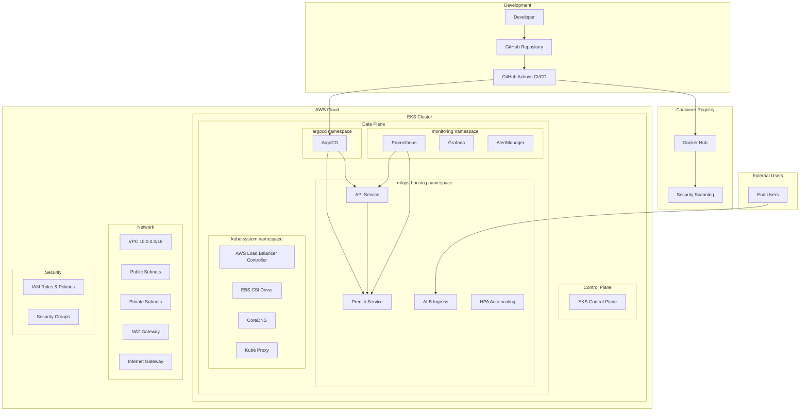

# MLOps Platform Architecture on AWS

## 🏗️ Architecture Overview

This document describes the complete architecture of the MLOps Housing Price Prediction platform deployed on AWS using modern cloud-native technologies.

## 📐 High-Level Architecture



## 🔧 Component Details

### 1. Container Runtime Layer

#### **Docker Images**
- **API Service**: FastAPI-based REST API for housing predictions
- **Predict Service**: ML inference service with scikit-learn model
- **Base Image**: Python 3.11-slim for security and size optimization

#### **Container Registry**
- **Docker Hub**: Public/private registry for container storage
- **Image Scanning**: Trivy security vulnerability scanning
- **Image Versioning**: SHA-based tagging for traceability

### 2. Kubernetes Orchestration Layer

#### **Amazon EKS (Elastic Kubernetes Service)**
```yaml
Control Plane:
  Version: 1.28
  Managed by: AWS
  High Availability: Multi-AZ
  Security: 
    - RBAC enabled
    - Network policies
    - Pod security standards

Data Plane:
  Node Groups:
    - Main: t3.medium (2-10 nodes, On-Demand)
    - Spot: t3.medium/large (0-5 nodes, Spot)
  Auto Scaling: Cluster Autoscaler
  Storage: EBS CSI Driver
```

#### **Core Services**
- **CoreDNS**: Cluster DNS resolution
- **AWS Load Balancer Controller**: ALB/NLB integration
- **Metrics Server**: Resource usage metrics
- **EBS CSI Driver**: Persistent volume management

### 3. Application Layer

#### **API Service**
```yaml
Deployment:
  Replicas: 3
  Strategy: RollingUpdate
  Resources:
    Requests: 200m CPU, 256Mi memory
    Limits: 500m CPU, 512Mi memory
  Health Checks:
    Liveness: /health every 10s
    Readiness: /health every 5s
  Auto-scaling: 2-10 replicas based on CPU/memory
```

#### **Predict Service**
```yaml
Deployment:
  Replicas: 2
  Strategy: RollingUpdate  
  Resources:
    Requests: 500m CPU, 1Gi memory
    Limits: 1000m CPU, 2Gi memory
  Health Checks:
    Liveness: /health every 10s (60s initial delay)
    Readiness: /health every 5s (30s initial delay)
  Auto-scaling: 2-8 replicas based on CPU/memory
```

### 4. Networking Layer

#### **Amazon VPC**
```yaml
CIDR: 10.0.0.0/16
Subnets:
  Public: 
    - 10.0.101.0/24 (us-west-2a)
    - 10.0.102.0/24 (us-west-2b)  
    - 10.0.103.0/24 (us-west-2c)
  Private:
    - 10.0.1.0/24 (us-west-2a)
    - 10.0.2.0/24 (us-west-2b)
    - 10.0.3.0/24 (us-west-2c)

Connectivity:
  Internet Gateway: Public subnet access
  NAT Gateway: Private subnet outbound access
  Route Tables: Separate for public/private
```

#### **Load Balancing**
```yaml
Application Load Balancer:
  Type: Internet-facing
  Scheme: Layer 7 (HTTP/HTTPS)
  Targets: EKS worker nodes
  Health Checks: /health endpoints
  SSL: AWS Certificate Manager (optional)

Service Mesh: 
  Type: Native Kubernetes services
  DNS: CoreDNS cluster DNS
  Service Discovery: Kubernetes native
```

### 5. Security Layer

#### **Identity and Access Management**
```yaml
EKS Cluster Role:
  - AmazonEKSClusterPolicy
  
Node Group Role:
  - AmazonEKSWorkerNodePolicy
  - AmazonEKS_CNI_Policy
  - AmazonEC2ContainerRegistryReadOnly
  
Load Balancer Controller:
  - Custom IAM policy for ALB/NLB management
  
Pod Security:
  - Non-root user execution
  - Read-only root filesystem
  - Capability dropping
```

#### **Network Security**
```yaml
Security Groups:
  EKS Cluster: Managed by AWS
  Node Groups: Worker node communication
  ALB: HTTP/HTTPS from internet
  
Network Policies:
  Namespace isolation
  Pod-to-pod communication rules
  Ingress/egress traffic control
```

### 6. GitOps and Deployment Layer

#### **ArgoCD**
```yaml
Installation: Helm chart in argocd namespace
Features:
  - Automated sync from Git repository
  - Rollback capabilities
  - Multi-environment support
  - RBAC integration
  - UI dashboard
  
Sync Policy:
  Automated: true
  Prune: true (remove deleted resources)
  Self-heal: true (fix drift)
  Retry: 5 attempts with backoff
```

#### **CI/CD Pipeline**
```yaml
GitHub Actions Workflow:
  1. Code commit/push
  2. Unit tests execution
  3. Docker image build
  4. Security scanning (Trivy)
  5. Integration tests
  6. Image push to Docker Hub
  7. Kubernetes manifest update
  8. ArgoCD auto-sync trigger
```

### 7. Monitoring and Observability Layer

#### **Prometheus Stack**
```yaml
Components:
  - Prometheus: Metrics collection
  - Grafana: Visualization dashboards  
  - AlertManager: Alert routing
  - Node Exporter: Node metrics
  - Kube State Metrics: Kubernetes metrics

Storage:
  Prometheus: 20Gi persistent volume
  Grafana: 10Gi persistent volume
  Retention: 30 days

Dashboards:
  - Kubernetes cluster overview
  - Application performance
  - Resource utilization
  - Custom MLOps metrics
```

#### **Logging**
```yaml
Application Logs:
  - Structured logging with JSON
  - Log levels: DEBUG, INFO, WARN, ERROR
  - Request/response logging
  - Performance metrics

Container Logs:
  - stdout/stderr capture
  - Kubernetes log aggregation
  - Searchable via kubectl logs
```

### 8. Auto-scaling Layer

#### **Horizontal Pod Autoscaler (HPA)**
```yaml
API Service HPA:
  Min Replicas: 2
  Max Replicas: 10
  Target CPU: 70%
  Target Memory: 80%
  Scale Down: 50% every 5 minutes
  Scale Up: 100% every 30 seconds

Predict Service HPA:
  Min Replicas: 2
  Max Replicas: 8
  Target CPU: 60% (lower for ML workloads)
  Target Memory: 75%
  Scale Down: 25% every 10 minutes (conservative)
  Scale Up: 50% every 60 seconds
```

#### **Cluster Autoscaler**
```yaml
Node Scaling:
  Main Node Group: 2-10 nodes
  Spot Node Group: 0-5 nodes
  Scale Down Delay: 10 minutes
  Scale Up: Based on pending pods
```

### 9. Storage Layer

#### **Persistent Storage**
```yaml
EBS Volumes:
  Storage Class: gp2 (General Purpose SSD)
  Prometheus: 20Gi for metrics storage
  Grafana: 10Gi for dashboard storage
  Applications: EmptyDir for temporary data

Volume Management:
  CSI Driver: AWS EBS CSI Driver
  Dynamic Provisioning: Enabled
  Backup: EBS snapshots (manual/automated)
```

## 🔄 Data Flow

### 1. Development to Production Flow
```
Developer → Git Push → GitHub Actions → Docker Build → Security Scan → 
Docker Hub → ArgoCD Sync → Kubernetes Deployment → Load Balancer → Users
```

### 2. Request Flow
```
User Request → ALB → Ingress Controller → API Service → Predict Service → 
ML Model → Response → API Service → ALB → User
```

### 3. Monitoring Flow
```
Applications → Prometheus Metrics → Grafana Dashboards → Alerts → 
AlertManager → Notification Channels
```

## 📊 Scalability Characteristics

### **Horizontal Scaling**
- **API Service**: 2-10 replicas based on CPU/memory
- **Predict Service**: 2-8 replicas based on load
- **Cluster Nodes**: 2-15 nodes across multiple AZs

### **Vertical Scaling**
- **Resource Limits**: Configurable per service
- **Node Instance Types**: t3.medium to t3.xlarge
- **Storage**: Dynamic EBS volume expansion

### **Geographic Scaling**
- **Multi-AZ**: High availability across 3 AZs
- **Multi-Region**: Terraform supports multiple regions
- **Edge Caching**: CloudFront integration (optional)

## 🛡️ Security Architecture

### **Defense in Depth**
1. **Network**: VPC isolation, security groups, NACLs
2. **Cluster**: RBAC, pod security policies, network policies
3. **Container**: Non-root users, read-only filesystems
4. **Application**: Input validation, rate limiting
5. **Data**: Encryption at rest and in transit

### **Compliance Features**
- **Audit Logging**: EKS control plane logs
- **Image Scanning**: Vulnerability detection
- **Access Control**: Fine-grained RBAC
- **Network Isolation**: Namespace and pod policies

## 💰 Cost Optimization

### **Resource Efficiency**
- **Spot Instances**: 60-90% cost savings for non-critical workloads
- **Resource Requests/Limits**: Prevent over-provisioning
- **Auto-scaling**: Scale down during low usage
- **Storage Optimization**: GP2 volumes with appropriate sizing

### **Cost Monitoring**
- **AWS Cost Explorer**: Resource cost analysis
- **Kubernetes Resource Quotas**: Prevent resource sprawl
- **Tagging Strategy**: Cost allocation and tracking

## 🔮 Future Enhancements

### **Performance Optimizations**
- **Container Optimization**: Multi-stage builds, distroless images
- **Caching**: Redis for prediction caching
- **CDN**: CloudFront for static assets
- **Database**: RDS for persistent data

### **Advanced Features**
- **Service Mesh**: Istio for advanced traffic management
- **Event-Driven**: Kafka for real-time data processing
- **ML Operations**: Kubeflow for ML pipeline management
- **Chaos Engineering**: Chaos Monkey for resilience testing

### **Enterprise Features**
- **Multi-Tenancy**: Namespace isolation for different teams
- **Backup & Disaster Recovery**: Cross-region replication
- **Advanced Monitoring**: Distributed tracing with Jaeger
- **Policy Management**: Open Policy Agent (OPA) for governance

This architecture provides a solid foundation for a production-ready MLOps platform with excellent scalability, security, and operational characteristics.